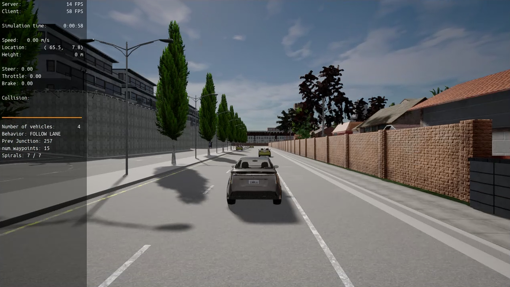
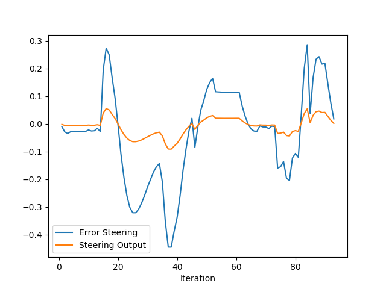
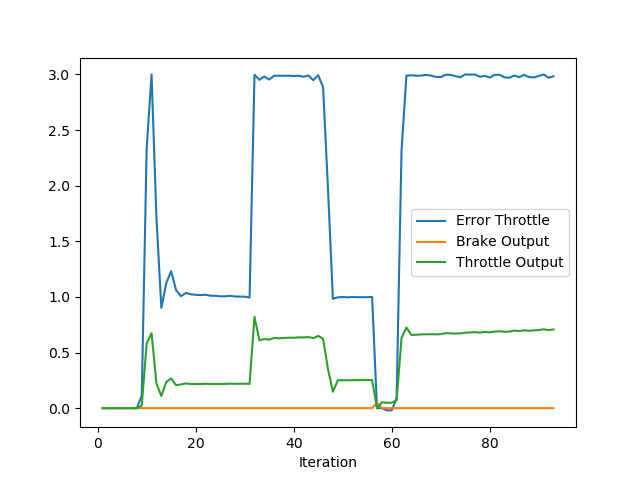

## Summary
This project consisted of writing a PID control class in C++ and then using that class to implement PID controllers for the steering and throttle of a vehicle in the CARLA simulator.  The PID Class consisted of various variables that hold the proportional, integral, and derivative gains of the controller and 3 more variables that hold the current proportional, integral, and derivate errors of the controller.  There is also a delta time variable that keeps track of the elapsed time since last update.  There is a method to initialize the controller which sets the variables to the passed in values to prepare the controller to begin its task.  Then there are methods to update the delta time, and calculate the errors and the total errors.

This controller implementation was then used to control both the throttle and the steering angle of the vehicle.  The angle between the vehicle and the closest point on the trajectory to the car is found, and the difference between this angle and the actual heading of the vehicle is used as the error signal for the steering PID controller.  For the throttle controller, the velocity of the closest point in the trajectory to the vehicle is used to calculate the error signal by subtracting the current velocity from this value.

## Instructions
To run the simulation go to the directory and build the project:
```bash
cd project/pid_controller
cmake .
make
```
After, the compilation finishes successfully, install the dependencies:
```bash
cd ..
./install-ubuntu.sh
```
Then start the CARLA simulator in a separate terminal window:
```bash
cd /opt/carla-simulator/
SDL_VIDEODRIVER=offscreen ./CarlaUE4.sh -opengl
```
Now, you can start the simulation by running:
```bash
./run_main_pid.sh
```
In order to plot your results, first install pandas and matplotlib, and then run the following script:
```bash
pip3 install pandas matplotlib
python3 plot_pid.py
```

## File Explanation
There are 3 files that were required to be updated.
### pid_controller.h
This is the header file for the PID controller implementation which contains the definition of the class and all the variables and methods that it will contain.
### pid_controller.cpp
This is the implementation file which writes the C++ code for the definition of the PID controller class.
### main.cpp
This is the main file which includes the starting point for the compiled program and in particular, the calculations for the error signals for both the steering and throttle PID controllers.  This file also initializes the PID controllers and where the update methods for delta time, error and total error are called.  Many values for the gains were tested here in this file.


## Report
I first implemented the PID controller class.  Both the .h file and .cpp file were written and the Project was compiled and then the simulation ran.  The following screenshot was taken:


The TODOs in the main.cpp file were then updated and after running the simulation and plotting the results, the following plots are obtained:


This plot shows a graph of the error signal and also the actual steering output after the PID control calculations.  As you can see, the steering output tracks the steering error but is slower to rapid changes in the error.


This plot displays the error throttle signal and the brake and throttle outputs after running the PID calculation.  Once again, the throttle output in this case tracks the throttle error but is reduced in amplitude before being applied to the actual vehicle throttle.  The brake output will only be other than zero when there is no throttle being applied.

The P gain is the Proportional gain and will change the amplitude of the error signal directly.  The I gain is the Integral gain and this value will decrease the offset error, but if too much gain is used the controller will begin to oscillate.  The D gain is the derivative gain and is used to sort of predict the change in the error signal and can be tuned to adjust the controller to fast changes in the error signal.  

While researching tuning methods of PID controllers, I found some common approaches that include first setting all gains to zero, and then slowly adjusting the proportional gain until the system begins to oscillate.  Then reduce the gain by half.  Then you slowly increase the integral gain until you take care of any offset in the error and output signals.  The gain is then set to half this value.  Finally, the derivative gain can then be increased until the controller reacts quickly to rapid changes in the error signal and the amount of overshoot is minimized to the desired level.  You could write a program that does this automatically by changing the gains of the controller as mentioned above and measuring the overshoot, settling time, and other factors in order to guide the increase and decrease of the gains individually until the measured values meet some threshold.  This algorithm would be run when the controller experienced a step changes in its error signal.  However, this would probably be more difficult than it seems I imagine.  But if done correctly, could allow you to calculate automatically.

The PID controller that was implemented in this project was a model free controller and did not include a model of the vehicle.  Using a controller with a model of the vehicle could allow for more accurate results and better control of the vehicle but at the price of a higher computational load and higher implementation complexity.  Being able to predict to some extent what the vehicle will do before actually doing it allows the controller to take this information into account before executing the actual command.  Where as a model free controller executes the command without any knowledge of the dynamics of the process it is controlling.  


